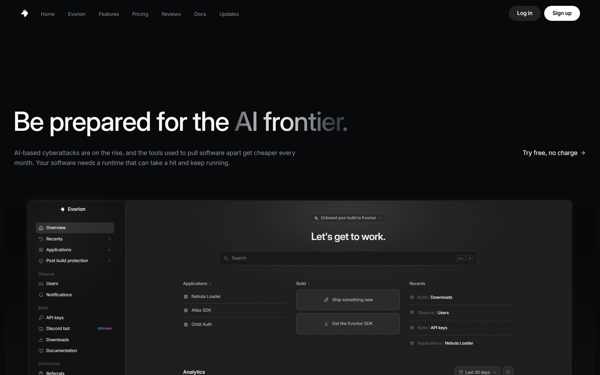
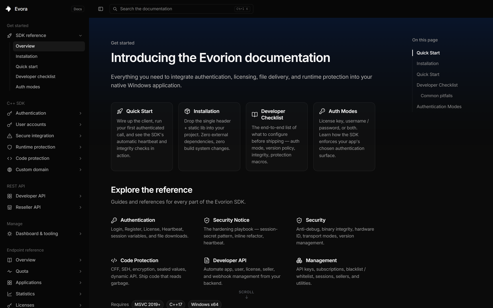
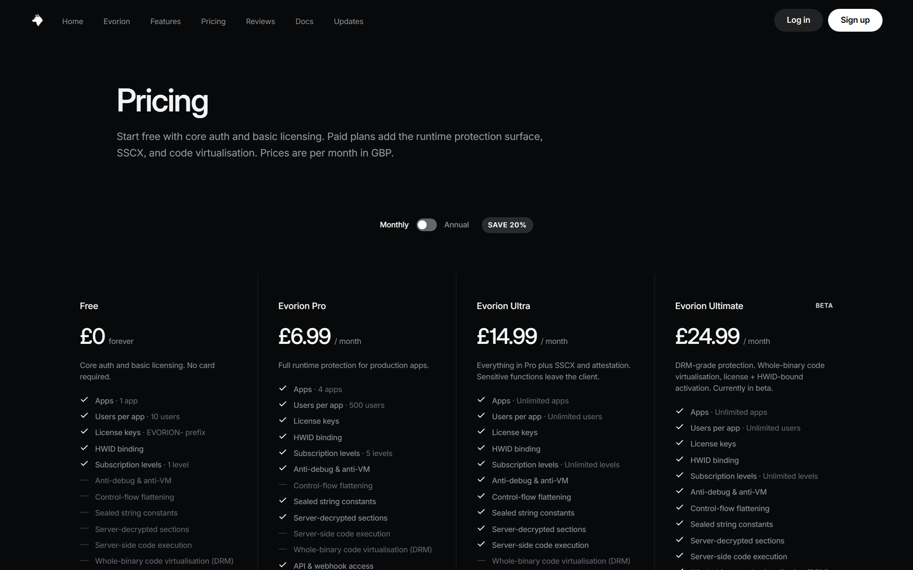
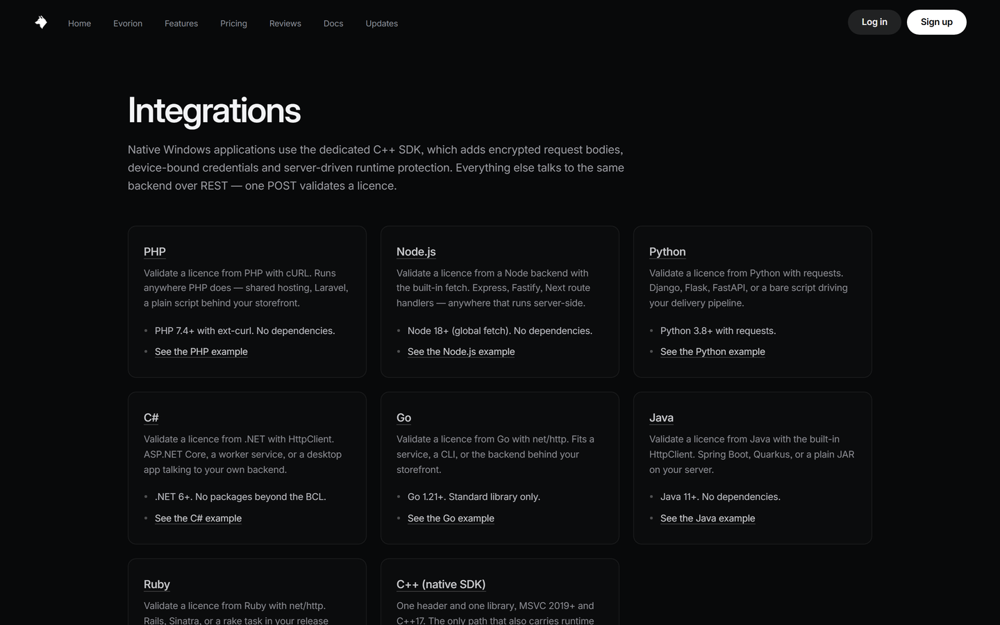

# Evora web

The public website for [Evora](https://evora.cx): marketing pages, the
documentation, and the shared UI components they are built from. Next.js.



<table>
  <tr>
    <td width="33%"><a href="docs/screenshots/docs.png"></a><br><sub>Documentation</sub></td>
    <td width="33%"><a href="docs/screenshots/pricing.png"></a><br><sub>Pricing</sub></td>
    <td width="33%"><a href="docs/screenshots/integrations.png"></a><br><sub>Integrations</sub></td>
  </tr>
</table>

## Running it

Requires Node 20 or newer.

```bash
npm install
npm run dev
```

The site runs at http://localhost:3002. `npm run build` produces a production
build.

## Layout

- `src/app` — pages. Each folder is a route, so `src/app/pricing` serves
  `/pricing`. Documentation lives in `src/app/docs`.
- `src/components` — shared components. `src/components/kit` is the design
  system the rest is built on.
- `src/lib` — site config, SEO metadata, changelog data.
- `public` — images, fonts, and the API spec.

## Scope

This repository covers the public site only. The customer dashboard, the
reseller panel and internal tooling are not included. Some links point into
those areas and resolve against the live site.

The nav font used on the live site is licensed and cannot be redistributed, so
it falls back to Inter here.

A few pages call the Evora API for optional content such as the promotion
banner. Those requests fail silently and the pages render without them.

`npm run lint` reports pre-existing warnings and errors inherited from the main
codebase.

## Configuration

Copy `.env.example` to `.env.local` to override the API host:

- `NEXT_PUBLIC_API_BASE` — defaults to the host the site is served from.

## Licence

Apache License 2.0. See [LICENSE](LICENSE) and [NOTICE](NOTICE).

"Evora" and the Evora logo are trademarks and are not licensed by it. Replace
the branding and the assets in `public/` in any derived work.
